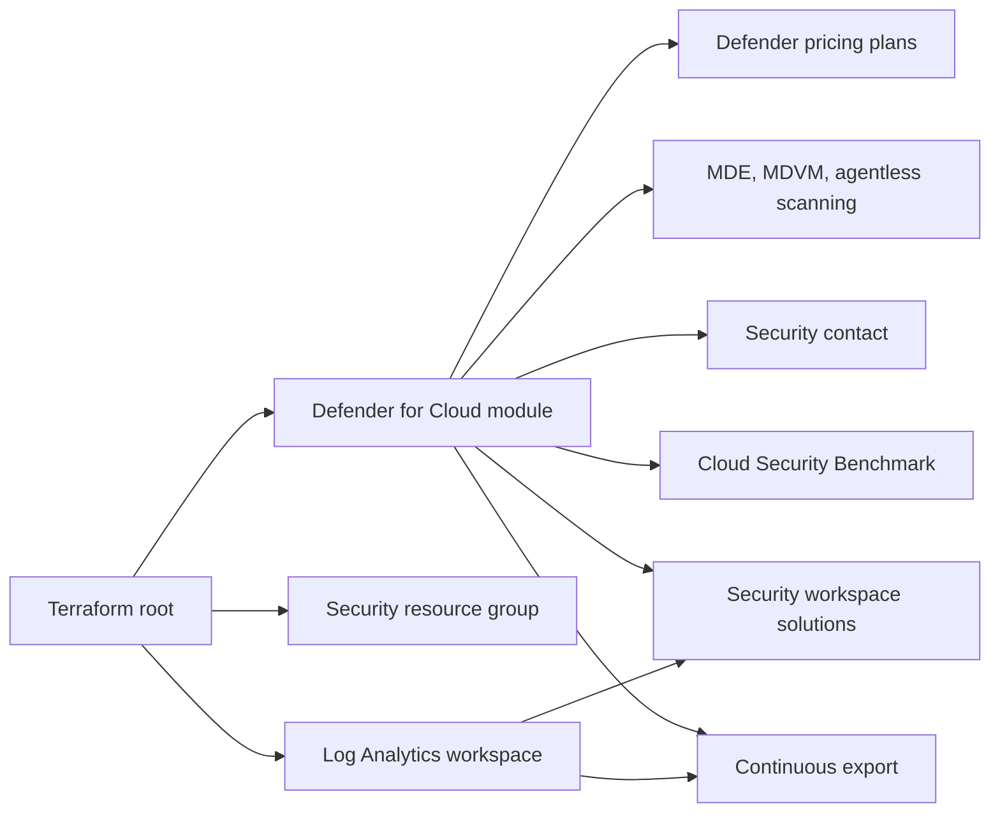

# Terraform Microsoft Defender for Cloud

Reusable Terraform configuration for onboarding Azure subscriptions to Microsoft Defender for Cloud across development, staging, and production environments.

The repository configures approved Defender plans, Microsoft Defender for Endpoint integration, vulnerability assessment, agentless VM scanning, Log Analytics integration, continuous export, and the Microsoft Cloud Security Benchmark.

> [!IMPORTANT]
> Defender `Standard` plans are billable. Review plan selection and estimated cost with your security and FinOps teams before deployment.

## Capabilities

- Enables Microsoft Defender for Servers P2.
- Enables Defender for App Service.
- Enables all four database protection plans.
- Enables Defender for Storage v2.
- Enables Defender for Containers.
- Enables Defender for AI Services.
- Enables Defender for Key Vault.
- Enables Defender for Resource Manager.
- Keeps Defender for APIs disabled.
- Configures Microsoft Defender for Endpoint integration.
- Selects Microsoft Defender Vulnerability Management for servers.
- Enables agentless VM scanning.
- Creates and associates a Log Analytics workspace.
- Installs the `Security` and `SecurityCenterFree` workspace solutions.
- Exports medium/high alerts, secure scores, and secure score controls.
- Configures a security contact.
- Optionally assigns the Microsoft Cloud Security Benchmark initiative.
- Adopts Azure-created Defender settings through declarative Terraform imports.
- Supports isolated state and tfvars for `dev`, `staging`, and `prod`.

## Defender Plans

| Portal plan | Pricing resource | Tier | Subplan |
|---|---|---|---|
| Servers | `VirtualMachines` | `Standard` | `P2` |
| App Service | `AppServices` | `Standard` | Default |
| SQL databases | `SqlServers` | `Standard` | Default |
| SQL servers on machines | `SqlServerVirtualMachines` | `Standard` | Default |
| Open-source relational databases | `OpenSourceRelationalDatabases` | `Standard` | Default |
| Cosmos DB | `CosmosDbs` | `Standard` | Default |
| Storage | `StorageAccounts` | `Standard` | `DefenderForStorageV2` |
| Containers | `Containers` | `Standard` | Default |
| AI Services | `AI` | `Standard` | Default |
| Key Vault | `KeyVaults` | `Standard` | `PerKeyVault` |
| Resource Manager | `Arm` | `Standard` | `PerSubscription` |
| APIs | `Api` | Off | Not configured |

The AzureRM provider version used by this repository does not accept `AI` as a pricing resource type. Defender for AI is therefore managed through `azapi_resource` using `Microsoft.Security/pricings@2024-01-01`.

## Architecture



## Repository Layout

```text
.
|-- main.tf                         # Root resources and module call
|-- variables.tf                    # Root input variables and defaults
|-- outputs.tf                      # Defender plan and workspace outputs
|-- provider.tf                     # Terraform, AzureRM, AzAPI, and backend
|-- imports.tf                      # Declarative imports for existing settings
|-- modules/
|   `-- defender_for_cloud/
|       |-- main.tf
|       |-- variables.tf
|       |-- outputs.tf
|       `-- versions.tf
`-- environments/
    |-- dev.tfvars.example
    |-- staging.tfvars.example
    |-- prod.tfvars.example
    `-- backend/
        |-- dev.backend.hcl.example
        |-- staging.backend.hcl.example
        `-- prod.backend.hcl.example
```

## Requirements

| Component | Version or requirement |
|---|---|
| Terraform | `>= 1.7.0` |
| AzureRM provider | `4.21.0` |
| AzAPI provider | `~> 2.0` |
| Azure CLI | Current supported version |
| Azure subscription | Active and accessible by the deployment identity |
| Remote state | Azure Storage account and blob container |

Terraform 1.7 or newer is required because `imports.tf` uses `for_each` in declarative import blocks.

## Required Azure Providers

Register these resource providers in every target subscription:

```powershell
$providers = @(
  'Microsoft.Security',
  'Microsoft.PolicyInsights',
  'Microsoft.OperationalInsights',
  'Microsoft.OperationsManagement'
)

foreach ($provider in $providers) {
  az provider register --namespace $provider
}

az provider list `
  --query "[?contains(['Microsoft.Security','Microsoft.PolicyInsights','Microsoft.OperationalInsights','Microsoft.OperationsManagement'], namespace)].{namespace:namespace,state:registrationState}" `
  --output table
```

Wait until every provider reports `Registered`.

## Deployment Permissions

The deployment identity needs permission to:

- Manage `Microsoft.Security/pricings` and Defender environment settings.
- Create resource groups and apply all policy-required tags.
- Create and configure Log Analytics workspaces.
- Create Microsoft Operations Management solutions.
- Create Defender continuous-export automation.
- Read and update existing subscription-level Defender resources.
- Create policy assignments when `assign_security_benchmark = true`.
- Read and write Terraform state in the Azure Storage backend.

A typical deployment identity requires Contributor at subscription scope, Storage Blob Data Contributor on the state container, and permission to create policy assignments. Confirm the least-privilege role design with your Azure security team.

## Configure an Environment

Copy the example files for the environment being deployed:

```powershell
$environment = 'dev' # dev, staging, or prod

Copy-Item "environments/$environment.tfvars.example" "environments/$environment.tfvars"
Copy-Item "environments/backend/$environment.backend.hcl.example" "environments/backend/$environment.backend.hcl"
```

Update the tfvars file with:

- The target subscription ID.
- Azure region.
- Resource group and globally unique Log Analytics workspace names.
- Security-team email and optional E.164 phone number.
- Required organizational tags.
- Whether the deployment identity can assign the security benchmark.

Update the backend file with the approved state resource group, storage account, container, and environment-specific key.

Populated `*.tfvars` and `*.backend.hcl` files are ignored by Git. Example files remain safe to commit.

## Remote State Isolation

Every environment must have a separate state key:

| Environment | Recommended state key |
|---|---|
| Development | `defender/dev.tfstate` |
| Staging | `defender/staging.tfstate` |
| Production | `defender/prod.tfstate` |

Do not use one environment's backend with another environment's tfvars. Do not copy state between environments.

## Deploy

### 1. Select the target subscription

```powershell
$environment = 'dev'
$tfvars = "environments/$environment.tfvars"
$backend = "environments/backend/$environment.backend.hcl"

az login
az account set --subscription '<target-subscription-id>'
az account show --query '{name:name,id:id,tenantId:tenantId,state:state}' --output table
```

Confirm the displayed subscription matches `subscription_id` in the selected tfvars file.

### 2. Initialize Terraform

```powershell
terraform init -reconfigure -backend-config=$backend
```

Commit `.terraform.lock.hcl` so all environments use the same provider versions.

### 3. Validate

```powershell
terraform fmt -check -recursive
terraform validate
```

### 4. Plan

```powershell
terraform plan `
  -input=false `
  -var-file=$tfvars `
  -out="$environment.tfplan"

terraform show -no-color "$environment.tfplan"
```

Review the complete plan. First-time deployments normally show imports because Azure creates Defender pricing and settings when a subscription is onboarded.

Do not approve a plan that unexpectedly destroys or replaces imported Defender resources.

### 5. Apply

```powershell
terraform apply -input=false "$environment.tfplan"
```

Apply only the reviewed saved plan. Require approval gates for staging and production.

## Existing Defender Resources

Azure normally creates these resources before Terraform manages them:

- Defender pricing resources.
- Microsoft Defender for Endpoint setting.
- Microsoft Defender Vulnerability Management setting.
- Agentless VM scanner setting.

The root `imports.tf` adopts them into the selected environment's state. Existing plan extension blocks are preserved to prevent Terraform from removing portal-managed Defender capabilities.

Do not delete the import blocks to work around an `already exists` error. Instead, confirm that the resource ID and selected subscription are correct.

## Post-Deployment Verification

### Terraform convergence

```powershell
terraform plan `
  -input=false `
  -detailed-exitcode `
  -var-file=$tfvars
```

Terraform exit codes:

- `0`: no changes; infrastructure matches configuration.
- `1`: error.
- `2`: changes detected.

### Defender pricing

```powershell
az security pricing list `
  --subscription '<target-subscription-id>' `
  --query "value[?name=='VirtualMachines' || name=='AppServices' || name=='SqlServers' || name=='SqlServerVirtualMachines' || name=='OpenSourceRelationalDatabases' || name=='CosmosDbs' || name=='StorageAccounts' || name=='Containers' || name=='AI' || name=='KeyVaults' || name=='Arm'].{plan:name,tier:pricingTier,subPlan:subPlan}" `
  --output table
```

All listed plans must report `Standard` with the expected subplans.

### Resource group and workspace

```powershell
az group show `
  --name '<resource-group-name>' `
  --subscription '<target-subscription-id>' `
  --query '{name:name,location:location,state:properties.provisioningState,tags:tags}' `
  --output json

az monitor log-analytics workspace show `
  --resource-group '<resource-group-name>' `
  --workspace-name '<workspace-name>' `
  --subscription '<target-subscription-id>' `
  --query '{name:name,location:location,state:provisioningState,retention:retentionInDays}' `
  --output json
```

Both resources must report `Succeeded`.

### Azure portal

1. Open **Microsoft Defender for Cloud**.
2. Select **Environment settings**.
3. Select the target subscription.
4. Confirm the plan selection and subplans.
5. Confirm Defender for APIs remains Off.
6. Confirm continuous export targets the correct Log Analytics workspace.
7. Confirm the security contact and notification settings.
8. Review coverage and recommendations after onboarding completes.

## Environment Promotion

Promote the same reviewed Terraform version in this order:

1. Deploy and verify development.
2. Plan, approve, deploy, and verify staging.
3. Plan, approve, deploy, and verify production.

Promote source code, not state files or saved plans. Generate a new plan in each environment using its own credentials, tfvars, and backend.

## Input Reference

| Variable | Type | Required | Description |
|---|---|---|---|
| `subscription_id` | `string` | Yes | Subscription to configure |
| `environment` | `string` | Yes | `dev`, `staging`, or `prod` |
| `resource_group_name` | `string` | Yes | Resource group for monitoring resources |
| `log_analytics_workspace_name` | `string` | Yes | Log Analytics workspace name |
| `security_contact_email` | `string` | Yes | Defender notification address |
| `location` | `string` | No | Azure region; default `eastus` |
| `security_contact_phone` | `string` | No | E.164 contact number |
| `log_analytics_sku` | `string` | No | Default `PerGB2018` |
| `log_retention_in_days` | `number` | No | Default `90` |
| `defender_plans` | `map(object)` | No | Defender plan selection |
| `assign_security_benchmark` | `bool` | No | Assign MCSB; default `true` |
| `enable_mde_integration` | `bool` | No | Enable MDE; default `true` |
| `enable_mdvm` | `bool` | No | Select MDVM; default `true` |
| `enable_agentless_vm_scanning` | `bool` | No | Enable scanning; default `true` |
| `enable_continuous_export` | `bool` | No | Enable exports; default `true` |
| `enable_workspace_solutions` | `bool` | No | Install solutions; default `true` |
| `tags` | `map(string)` | No | Organizational tags |

## Outputs

| Output | Description |
|---|---|
| `defender_plan_ids` | IDs of managed Defender pricing resources |
| `log_analytics_workspace_id` | ID of the Defender Log Analytics workspace |
| `security_benchmark_assignment_id` | MCSB assignment ID when enabled |

## Troubleshooting

### Resource group denied by policy

Read the Azure policy error and add every required tag to the environment's `tags` map. Resource-group tag policies are evaluated during creation.

### Policy assignment returns 403

The identity lacks `Microsoft.Authorization/policyAssignments/write`. Grant the required permission or set `assign_security_benchmark = false` only with security-team approval.

### Defender resource already exists

Confirm `imports.tf` is present, Terraform is version 1.7 or newer, and the selected subscription matches the tfvars file. Generate a new plan to execute declarative imports.

### Plan proposes destruction or replacement

Stop. Confirm current Azure subplans and plan extensions. Do not replace imported Defender pricing resources without security approval.

### Backend initialization fails

Confirm the backend file, storage account firewall, container, and Storage Blob Data Contributor assignment. Use `-migrate-state` when moving existing state and `-reconfigure` when selecting a backend without migration.

## Rollback and Removal

Do not use `terraform destroy` as the default Defender rollback. Destroying imported subscription-level settings can disable protection or cause unsupported replacement behavior.

Use a controlled corrective deployment:

1. Preserve state and plan output.
2. Obtain security and FinOps approval.
3. Change the affected plan tier or feature flag explicitly.
4. Generate and review a new plan.
5. Apply the approved corrective plan.

Removing continuous export or the Log Analytics workspace can affect security-data retention. Confirm retention and export requirements before removal.

## Security Considerations

- Never commit populated tfvars, backend credentials, Terraform state, or saved plans.
- Use workload identity federation or managed identity for CI/CD where available.
- Restrict state-container access because Terraform state can contain sensitive values.
- Require protected branches and environment approvals for production.
- Review Defender pricing before enabling new plans or extensions.
- Rotate security-contact details through controlled configuration changes.

## References

- [Deploy Microsoft Defender for Cloud via Terraform](https://techcommunity.microsoft.com/blog/microsoftdefendercloudblog/deploy-microsoft-defender-for-cloud-via-terraform/3563710)
- [Microsoft Defender for Cloud documentation](https://learn.microsoft.com/azure/defender-for-cloud/)
- [Terraform AzureRM provider](https://registry.terraform.io/providers/hashicorp/azurerm/latest/docs)
- [Terraform AzAPI provider](https://registry.terraform.io/providers/Azure/azapi/latest/docs)
